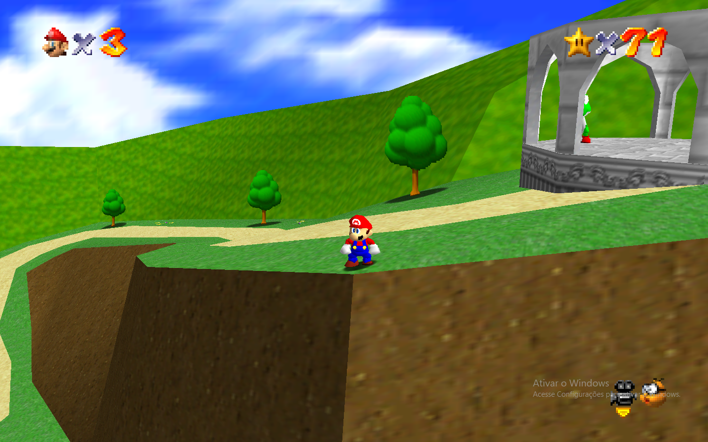

# Mirror mode

This mod adds a mirror mode to Super Mario 64, flipping the entire game world horizontally — including levels, objects, and animations.

Since it doesn't replace any geometry, so it should work with most custom levels and "romhacks" without issues.

Note that this mod only flips the camera controls if you're using the vanilla camera. If you're using a custom one (romhack camera, analog camera, mouse look), you might want to manually enable "Flip X axis" in your camera settings. 

Also, shoutouts to ManIsCat for helping me fix some rendering issues!

|  |  |
|-----------------------|-----------------------|
|  |  |